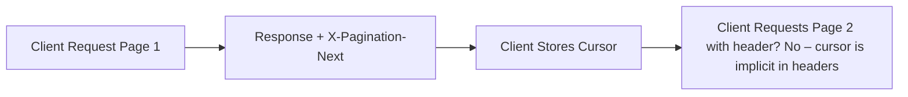

# Pagination & Cursors

Envoyou list endpoints use opaque forward cursor headers for consistent, low-latency traversal of large datasets.

## Headers

| Header | Purpose |
|--------|---------|
| `X-Pagination-Limit` | Effective page size applied by server |
| `X-Pagination-Next` | Cursor token for next page (omit = end) |

The cursor encodes position state (offset, filters, snapshot markers). Treat it as an opaque string—do not parse or modify.

## Basic Flow



**Currently, the next page is requested by repeating the same endpoint with an added query parameter `cursor` (planned) OR (current draft) by using the `X-Pagination-Next` value in a `cursor` query param:**

```http
GET /v1/measurements?limit=50&cursor=eyJvZmZzZXQiOjE1MH0
```

(If your current implementation does not yet accept `cursor`, treat the header as advisory until backend update.)

## Client Pattern (TypeScript)

```ts
interface Page<T> { items: T[]; next?: string; }

async function fetchAll<T>(baseUrl: string, limit = 50): Promise<T[]> {
  const results: T[] = [];
  let cursor: string | undefined;
  do {
    const url = new URL(baseUrl);
    url.searchParams.set('limit', String(limit));
    if (cursor) url.searchParams.set('cursor', cursor);
    const res = await fetch(url.toString());
    if (!res.ok) throw new Error(`HTTP ${res.status}`);
    const body = await res.json();
    results.push(...body.items || body);
    cursor = res.headers.get('X-Pagination-Next') || undefined;
  } while (cursor);
  return results;
}
```

## Retry & Cursor Stability

- Cursors remain valid at least 5 minutes from issuance (target SLA—finalize in contract docs).
- If a cursor becomes invalid, server SHOULD return `400` with `error=invalid_cursor`.

## Future Enhancements

| Feature | Description |
|---------|-------------|
| Bidirectional Cursors | Add `X-Pagination-Prev` for reverse traversal |
| Snapshot Isolation | Strong snapshot tokens for time-consistent paging |
| Total Count Hints | Optional `X-Pagination-Approx-Total` header |

## Anti-Patterns

- Manually decoding cursor payloads.
- Assuming sequential integers for offsets.
- Persisting cursors longer than their validity window without refresh.

## Related Docs

- Error Catalog: [error-catalog](https://docs.envoyou.com/docs/guides/error-catalog)
- Rate Limiting: [rate-limiting](https://docs.envoyou.com/docs/guides/rate-limiting)
- Observability: [observability](https://docs.envoyou.com/docs/guides/observability)
