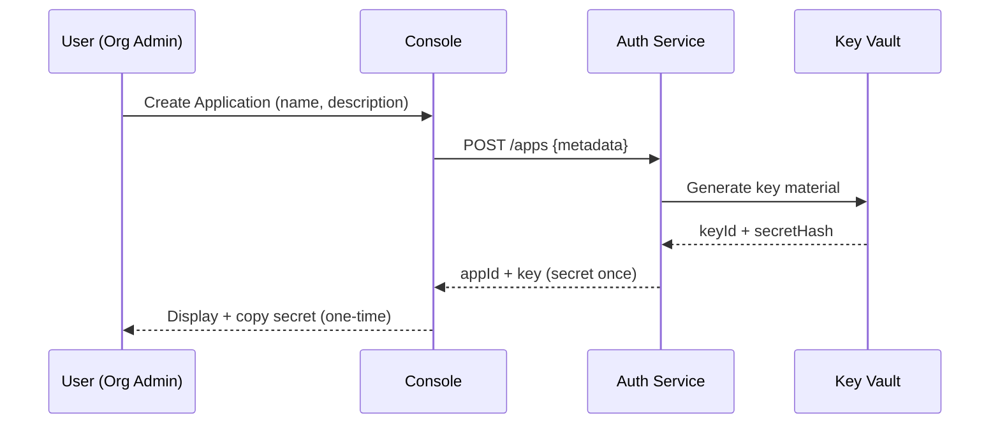

import Tabs from '@theme/Tabs';
import TabItem from '@theme/TabItem';

> Transform raw environmental & ESG signals into business, compliance, and investment decisions.

This page outlines flagship user-facing application patterns you can build (or we may offer natively) on top of the Envoyou platform **and** the concrete lifecycle of registering an application, provisioning secure API credentials, enforcing scopes, and operating reliably.

## Core Concepts

| Concept | Purpose | Notes |
| ------- | ------- | ----- |
| Application Registration | Establish identity & ownership | Produces `appId`, initial key pair |
| API Key (Server) | Server-to-server auth & rate scope | Rotatable; never expose client-side |
| Public Client ID | Identify browser / mobile client | Paired with PKCE or limited-scope token exchange |
| Scopes | Principle of least privilege | Example: `metrics.read`, `alerts.write` |
| Rotation | Limit blast radius | Dual-key overlap window recommended (e.g., 24h) |
| Revocation | Immediate risk mitigation | Invalidate compromised key + audit trail |

---

## 1. ESG Monitoring Dashboard
A central command surface that fuses environmental performance, risk signals, and benchmark context.

Related API Paths: `/benchmarks/industry/{code}`, `/benchmarks/peers`, `/alerts`, `/alerts/{id}` (see OpenAPI spec), plus existing measurement endpoints.

### Key Modules
- **CEVS Score Panel**: Real-time & historical trend (sparkline + delta vs last period). Include percentile vs industry.
- **Benchmark Comparator**: Select peers or auto-suggest top 5 by industry / market cap; visualize radar or stacked variance.
- **Risk & Deviation Feed**: Recent anomalies (e.g., water discharge spike, emissions gap, missing data submission).
- **Alert Center**: Configurable rules & thresholds with delivery channels (email, webhook, Slack, Teams).
- **Regulatory Change Feed**: Parsed + classified regulatory updates mapped to affected facilities or reporting frameworks.

### Suggested UI Layout
<Tabs>
<TabItem value="layout" label="Layout Sketch">
```text
--------------------------------------------------------
|  KPI Header (CEVS Score + Delta + Percentile)        |
--------------------------------------------------------
| Trend & Benchmarks  |  Alerts & Anomalies | Regulations |
| (line + radar)      |  (list + status)    | (feed)      |
--------------------------------------------------------
|   Facility Drilldown (map / table w/ filters)        |
--------------------------------------------------------
```
</TabItem>
<TabItem value="data" label="Data Contracts">
- `GET /companies/{id}/cevs-score` (current + history window)
- `GET /industries/{code}/benchmark` (percentiles, mean, median)
- `GET /facilities?companyId=...` (geo + operational attributes)
- `GET /alerts` & `POST /alerts` (rule definitions)
- `GET /regulations/updates` (filtered by region / sector)
</TabItem>
</Tabs>

Wireframe (v0.1):
> (Dashboard wireframe SVG placeholder – add `static/img/wireframes/dashboard-layout.svg` to restore image)

### Alert Rule Examples
```json title="Water Pollution Threshold"
{
  "metric": "water_discharge_ppm",
  "operator": ">",
  "threshold": 120,
  "window": "1h",
  "notify": ["webhook:ops_env", "email:env_manager@company.com"]
}
```
```json title="CEVS Score Drop"
{
  "metric": "cevs_score",
  "operator": "drop_percent",
  "threshold": 5,
  "window": "24h",
  "notify": ["slack:#esg-risk"]
}
```

### Implementation Notes
- Cache high-frequency metrics (5–15m) with a time-series store (e.g., Timescale / Influx) separate from transactional DB.
- Use WebSockets or Server-Sent Events for live score deltas; fall back to polling.
- Normalize regulatory feeds via ingestion workers; tag updates with taxonomy facets (framework, jurisdiction, topic).
- Provide role-based scopes: viewer (read metrics), analyst (create alerts), admin (manage peers & facilities).

---

## 2. Dual-Perspective Analytics (Investor & Company)
One analytics surface serving two distinct personas with filtered lenses.

### Investor Mode
Focus: Portfolio risk-adjusted ESG posture.

| Feature | Description |
| ------- | ----------- |
| Portfolio Aggregation | Weighted composite CEVS & sub-metrics across holdings. |
| Risk Outliers | Highlight bottom decile companies dragging portfolio score or breaching thresholds. |
| Scenario Analysis | Stress test portfolio against regulatory tightening or carbon pricing. |
| Diversification View | Sectoral exposure vs ESG variance matrix. |

### Company Mode
Focus: Operational performance & optimization.

| Feature | Description |
| ------- | ----------- |
| Facility Breakdown | Emissions, water, waste per facility with intensity normalization (per output unit). |
| Cross-Facility Benchmark | Rank facilities; surface top/bottom performers for targeted interventions. |
| Efficiency Opportunities | Algorithmic suggestions (e.g., "Switch Plant 3 coolant tower cycle to reduce water usage 8%" ). |
| Progress Toward Targets | Track science-based targets & forecast trajectories. |

### Shared Engine Components
- Metrics service (aggregation, unit normalization, gap filling).
- Benchmark resolver (industry + peer set logic).
- Scenario engine (parameterized shocks: carbon_price, regulation_delay, intensity_decline_rate).
- Recommendation engine (rule-based + ML ranking of interventions).

### Data API Sketch
```graphql title="Metrics Aggregation"
query PortfolioMetrics($ids: [ID!]!, $window: String!) {
  portfolio(ids: $ids) {
    compositeScore(window: $window) {
      value
      changePct
    }
    metrics(window: $window) {
      key
      value
      change
      confidence
    }
    riskOutliers(limit: 5) { id name score industry }
  }
}
```

---

## 3. Sustainability Reporting Integration
Accelerate GRI / SASB / CSRD aligned disclosures.

### Core Capabilities
- **Structured Export**: One-click export: `Export for GRI`, `Export for SASB`, `Export for CSRD` (ZIP containing CSV + JSON + mapping manifest).
- **Taxonomy Mapping Layer**: Internal metric keys ↔ external disclosure codes (versioned; diffable).
- **Change Log**: Track when source metrics or methodologies adjust (audit ready).
- **Webhook Feeds**: Push updated KPI bundles to downstream BI / data warehouse ingestion endpoints.

### Export Package Structure
```text
report_export_<framework>_<YYYYMMDD>/
  manifest.json      # dataset descriptors, version hashes
  metrics.csv        # flattened metric rows
  facilities.csv     # facility dimensional data
  methodology.md     # narrative / assumptions
  mappings.json      # internal key -> framework code
```

### Example `manifest.json`
```json
{
  "framework": "GRI",
  "version": "2025.2",
  "generatedAt": "2025-09-13T10:15:00Z",
  "recordCounts": {"metrics": 1842, "facilities": 27},
  "source": "envoyou-platform",
  "hash": "b1f7c0c2..."
}
```

### Webhook Delivery Contract
```http
POST /webhooks/report-update HTTP/1.1
Content-Type: application/json
X-Signature: t=1694592100,v1=3c5bd...
{
  "framework": "SASB",
  "bundleId": "sasb_2025_q3_rev1",
  "url": "https://exports.envoyou.com/bundles/sasb_2025_q3_rev1.zip",
  "delta": true,
  "changedSections": ["water_management", "emissions_scope2"],
  "generatedAt": "2025-09-13T10:20:11Z"
}
```

### Security & Governance
- Sign all webhook payloads (HMAC SHA-256 w/ secret per destination).
- Allow replay protection via timestamp + nonce.
- Maintain version graph of taxonomy mappings; expose diff endpoint.

---

## 4. Application Registration Workflow
A minimal, opinionated flow to onboard a new application consuming Envoyou APIs.



### Steps
1. Admin navigates to "Developer > Applications" and submits metadata.
2. Backend creates record (`apps` table) with status `active`.
3. Key service mints `keyId` + random 32+ byte secret; stores hash (HMAC-SHA256) + creation timestamp.
4. Plain secret returned once; UI enforces copy + acknowledges not stored in recoverable form.
5. Admin optionally assigns initial scopes (defaults: `metrics.read`).
6. Audit event `app.created` emitted.

### Suggested Table Schemas (Excerpt)
```sql
CREATE TABLE apps (
  id UUID PRIMARY KEY,
  owner_org UUID NOT NULL,
  name TEXT NOT NULL,
  description TEXT,
  created_at TIMESTAMPTZ NOT NULL DEFAULT now(),
  status TEXT NOT NULL CHECK (status IN ('active','suspended','deleted'))
);
CREATE TABLE app_keys (
  id UUID PRIMARY KEY,
  app_id UUID REFERENCES apps(id) ON DELETE CASCADE,
  key_id TEXT NOT NULL, -- short identifier prefix
  secret_hash TEXT NOT NULL,
  created_at TIMESTAMPTZ NOT NULL DEFAULT now(),
  expires_at TIMESTAMPTZ,
  last_used_at TIMESTAMPTZ,
  revoked_at TIMESTAMPTZ
);
CREATE TABLE app_scopes (
  app_id UUID REFERENCES apps(id) ON DELETE CASCADE,
  scope TEXT NOT NULL,
  granted_at TIMESTAMPTZ NOT NULL DEFAULT now(),
  PRIMARY KEY (app_id, scope)
);
```

---

## 5. API Keys & Rotation Strategy

| Scenario | Action | Notes |
| -------- | ------ | ----- |
| Scheduled rotation | Create new key (A2) keep old (A1) valid | Overlap window (e.g., 24h) |
| Compromise suspected | Mint new key + revoke all old | Document incident reference |
| Least-privilege tightening | Remove unused scopes | Emit `scope.revoked` event |
| Decommission app | Revoke keys + mark app deleted | Retain 90d metadata for audit |

### Rotation Example
```http
# Create new key
POST /apps/{appId}/keys
Authorization: Bearer <admin_token>

201 Created {"keyId":"k_9f3","secret":"env_live_a2..."}

# Revoke old key
DELETE /apps/{appId}/keys/k_8d1
```

### Implementation Tips
- Store only secret hash; compare using constant-time function.
- Prefix keys (e.g., `env_live_`) to simplify environment parsing.
- Log last 10 usages (timestamp + endpoint) for forensics; avoid full request body storage.

---

## 6. Scopes & Permissions

| Scope | Description | Typical Assignee |
| ----- | ----------- | ---------------- |
| metrics.read | Read measurement & benchmark metrics | Dashboards, analytics services |
| alerts.read | List & view alert definitions & events | Monitoring dashboard |
| alerts.write | Create/update/delete alert rules | Backoffice automation service |
| exports.read | Download reporting bundles | Reporting portal |
| exports.generate | Trigger new export generation | Reporting orchestrator |
| companies.read | Access company profile & facility list | Portfolio analytics |

### Evaluating Scopes
```pseudo
function authorize(app, requiredScopes):
  granted = fetchScopes(app.id)
  return all(scope in granted for scope in requiredScopes)
```

---

## 7. End-to-End Example Flow
Example: Dashboard server fetching metrics then creating an alert.

```bash
# 1. Fetch composite score
curl -H "Authorization: ApiKey env_live_a2X..." \
  https://api.envoyou.com/companies/123/cevs-score

# 2. List existing alerts
curl -H "Authorization: ApiKey env_live_a2X..." \
  https://api.envoyou.com/alerts

# 3. Create alert (requires alerts.write)
curl -X POST -H "Authorization: ApiKey env_live_a2X..." \
  -H "Content-Type: application/json" \
  -d '{"metric":"cevs_score","operator":"drop_percent","threshold":5,"window":"24h"}' \
  https://api.envoyou.com/alerts
```

Tokenless browser usage should proxy through your server; never embed full server key client-side. For public widgets use ephemeral signed tokens with narrow scope + TTL.

---

## 8. Security & Compliance Checklist
- [ ] Key secrets hashed (HMAC SHA-256 or Argon2id for long-term keys)
- [ ] Dual-key rotation supported
- [ ] Scope review automated (job flags unused >30d)
- [ ] All admin mutations emit audit events
- [ ] Webhook signatures validated with replay guard
- [ ] Rate limits per key + global fail-safe circuit
- [ ] Time-synchronized (NTP) infrastructure for consistent expiry
- [ ] Secrets never logged or shown after creation

---

## 9. Troubleshooting

| Symptom | Possible Cause | Resolution |
| ------- | -------------- | ---------- |
| 401 Unauthorized | Missing/invalid header | Ensure `Authorization: ApiKey <key>` sent |
| 403 Forbidden | Scope missing | Add required scope in console, retry |
| 429 Too Many Requests | Burst above rate limit | Implement client backoff + jitter |
| 410 Gone (key) | Key revoked | Mint new key and update deployments |
| Stale data | Cache not invalidated | Check cache TTL, purge after rotation |

---

## Architecture Layering
```text
[ Ingestion ] -> [ Normalization ] -> [ Metrics Store ] -> [ Application Services ] -> [ UI / Exports / Webhooks ]
                           ^                ^
                           |                |
                     Benchmark Engine   Taxonomy Mapper
```

### Cross-Cutting Concerns
- Idempotent ingestion & late-arriving data reconciliation.
- Time-zone & unit normalization early in pipeline.
- Observability: tracing around alert evaluation & export generation.
- Access control: attribute-based (role + company + facility scope).

---

## Build Roadmap (Indicative)

| Phase | Scope | Outcomes |
| ----- | ----- | -------- |
| 0 | Foundations | Metric catalog, baseline CEVS scoring, ingestion MVP |
| 1 | Monitoring | Dashboard widgets, alert rules engine, benchmarks |
| 2 | Dual Analytics | Investor + company lenses, scenario engine |
| 3 | Reporting | Export generator, taxonomy mapper, webhooks |
| 4 | Optimization | Intervention recommender, ML ranking, advanced forecasting |

## Next Steps
- Prioritize Phase 1 vs Phase 2 depending on go-to-market focus.
- Define core metric ontology & naming conventions (feeds everything).
- Begin alert rules engine schema & persistence design.
- Draft taxonomy mapping JSON structure & versioning strategy.

---

Need deeper solution design (schemas, ERD, rule engine DSL)? → Open an issue or reach out to the platform team.

---

Additional Resources:
- Alert Rule JSON Schema: `/schemas/alert-rule.schema.json`
- Taxonomy Mapping Example: `/taxonomy/mappings.example.json`
- OpenAPI Spec: `/openapi/envoyou-api.yaml`
